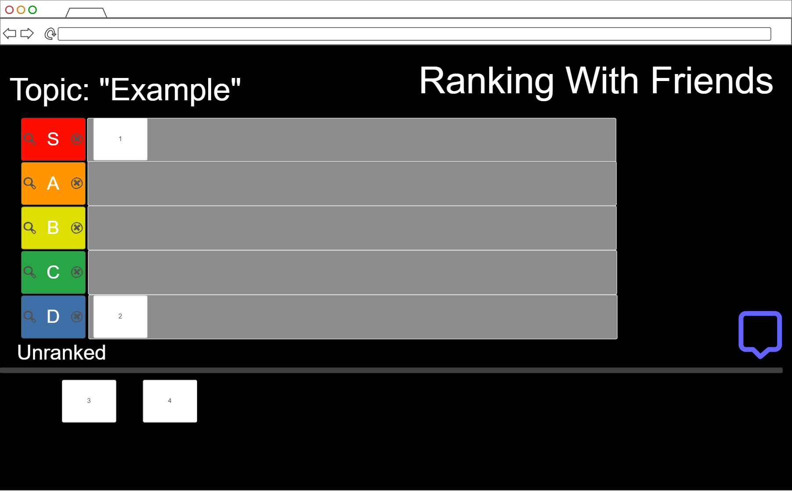

# Ranking with Friends
## Greyson King

[My Notes](notes.md)

## Startup Application Deliverable

### Brief Description

The title of my startup project is Ranking with Friends. As expressed in the title this project will allow friends to collaborate together to rank their favorite self-created subjects. As shown in rough sketches down below this uses the tier list system (S, A, B, C, D) with an unranked category beneath them all. The collaboration comes in the form of creator and participant. The creator goes to a page to create a category and a dynamic list of items to rank within that category. After creation a server generated join code is made that the creator can tell other participants authenticating that the right people are in the group.

### Elevator Pitch

Have you ever wondered how your opinions compare to your friends? Welcome to "Ranking with Friends" a new ranking system that allows friends to get together and rank anything from movies to basketball players. Using the template of tier lists allows for interesting rankings that can always be different through the voting system.

### Design

### Key Features

- Secure lobbies with server generated join codes
- Custom Tier lists with different topics and items
- Voting System for each item and the given tiers
- Tier List results are stored
- Ability to create individual username

### Technologies
#### I am going to use the required techologies in these ways:

- **HTML** - HTML is the framework for the application. Multiple HTML pages: Main menu, tier list creation, join page, tier list, and voting.
- **CSS** - CSS is the styling of the application. Used for different colors and font sizes depending on what is needed as seen in the design sketch.
- **React** - React will be used in the join code process/login. It will also be used in the voting system
- **Service** - Endpoints:
    1. Submitting votes
    2. Allocating correct items to correct tiers based on the tally
    3. Showing results
- **DB** 
    1. Storing custom topics/ideas for tier list
    2. Storing saved completed tier lists
    3. Remembering Votes and tier placement
- **Websocket** 
    1. Showing user votes to everyone
    2. Live chat sidebar
    3. Display the number of users voting on the list

## 🚀 AWS deliverable

For this deliverable I did the following. I checked the box `[x]` and added a description for things I completed.

- [ ] **Server deployed and accessible with custom domain name** - [My server link](https://yourdomainnamehere.click).

## 🚀 HTML deliverable

For this deliverable I did the following. I checked the box `[x]` and added a description for things I completed.

- [ ] **HTML pages** - I did not complete this part of the deliverable.
- [ ] **Proper HTML element usage** - I did not complete this part of the deliverable.
- [ ] **Links** - I did not complete this part of the deliverable.
- [ ] **Text** - I did not complete this part of the deliverable.
- [ ] **3rd party API placeholder** - I did not complete this part of the deliverable.
- [ ] **Images** - I did not complete this part of the deliverable.
- [ ] **Login placeholder** - I did not complete this part of the deliverable.
- [ ] **DB data placeholder** - I did not complete this part of the deliverable.
- [ ] **WebSocket placeholder** - I did not complete this part of the deliverable.

## 🚀 CSS deliverable

For this deliverable I did the following. I checked the box `[x]` and added a description for things I completed.

- [ ] **Visually appealing colors and layout. No overflowing elements.** - I did not complete this part of the deliverable.
- [ ] **Use of a CSS framework** - I did not complete this part of the deliverable.
- [ ] **All visual elements styled using CSS** - I did not complete this part of the deliverable.
- [ ] **Responsive to window resizing using flexbox and/or grid display** - I did not complete this part of the deliverable.
- [ ] **Use of a imported font** - I did not complete this part of the deliverable.
- [ ] **Use of different types of selectors including element, class, ID, and pseudo selectors** - I did not complete this part of the deliverable.

## 🚀 React part 1: Routing deliverable

For this deliverable I did the following. I checked the box `[x]` and added a description for things I completed.

- [ ] **Bundled using Vite** - I did not complete this part of the deliverable.
- [ ] **Components** - I did not complete this part of the deliverable.
- [ ] **Router** - I did not complete this part of the deliverable.

## 🚀 React part 2: Reactivity deliverable

For this deliverable I did the following. I checked the box `[x]` and added a description for things I completed.

- [ ] **All functionality implemented or mocked out** - I did not complete this part of the deliverable.
- [ ] **Hooks** - I did not complete this part of the deliverable.

## 🚀 Service deliverable

For this deliverable I did the following. I checked the box `[x]` and added a description for things I completed.

- [ ] **Node.js/Express HTTP service** - I did not complete this part of the deliverable.
- [ ] **Static middleware for frontend** - I did not complete this part of the deliverable.
- [ ] **Calls to third party endpoints** - I did not complete this part of the deliverable.
- [ ] **Backend service endpoints** - I did not complete this part of the deliverable.
- [ ] **Frontend calls service endpoints** - I did not complete this part of the deliverable.
- [ ] **Supports registration, login, logout, and restricted endpoint** - I did not complete this part of the deliverable.

## 🚀 DB deliverable

For this deliverable I did the following. I checked the box `[x]` and added a description for things I completed.

- [ ] **Stores data in MongoDB** - I did not complete this part of the deliverable.
- [ ] **Stores credentials in MongoDB** - I did not complete this part of the deliverable.

## 🚀 WebSocket deliverable

For this deliverable I did the following. I checked the box `[x]` and added a description for things I completed.

- [ ] **Backend listens for WebSocket connection** - I did not complete this part of the deliverable.
- [ ] **Frontend makes WebSocket connection** - I did not complete this part of the deliverable.
- [ ] **Data sent over WebSocket connection** - I did not complete this part of the deliverable.
- [ ] **WebSocket data displayed** - I did not complete this part of the deliverable.
- [ ] **Application is fully functional** - I did not complete this part of the deliverable.
